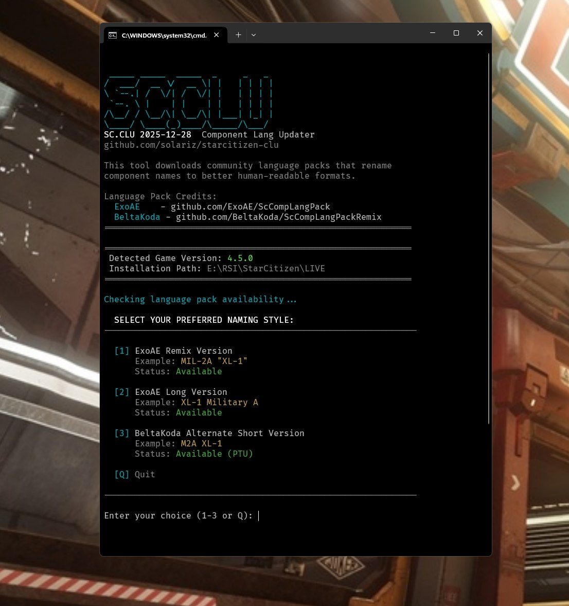

# SC.CLU - Star Citizen Component Language Updater

A Windows batch script that downloads and applies community language packs to rename component names in Star Citizen to better human-readable formats.

## What It Does

Star Citizen uses internal component names like `XL-1` that don't tell you anything about what the component grade or size. This tool automatically downloads community built language packs that rename these to descriptive names.

**Example transformations:**
| Original | ExoAE Remix | ExoAE Long | BeltaKoda Short |
|----------|-------------|------------|-----------------|
| `XL-1` | `MIL-2A "XL-1"` | `XL-1 Military A` | `M2A XL-1` |

The script:
- Detects your Star Citizen installation and game version
- Checks availability of language packs for your version
- Lets you choose your preferred naming style
- Downloads and installs the latest lang pack
- Can be re-run after patches to update the pack

## Screenshot

Simple Screenshot of the Script in Action:


## Language Pack Credits

This is not a Fork or clone of the Language packs, this tool just downloads language packs fromt their original source created and maintained by:

- **ExoAE** - [github.com/ExoAE/ScCompLangPack](https://github.com/ExoAE/ScCompLangPack)  
  Original Creator of the Lang Pack, provides both "Remix" and "Long" naming formats

- **BeltaKoda** - [github.com/BeltaKoda/ScCompLangPackRemix](https://github.com/BeltaKoda/ScCompLangPackRemix)  
  Provides the alternate short naming format

All credit for the language translations goes to these authors. This updater is simply a convenience tool to download their work.

## Usage

1. Download `update_language.cmd`
2. Place it in your Star Citizen LIVE folder, e.g.:
   ```
   C:\Program Files\Roberts Space Industries\StarCitizen\LIVE\
   ```
3. Double-click to run
4. Select your preferred naming style (1-3)
5. The script will download and install the language pack

### First-Time Setup

On first run, the script will automatically:
- Create the required folder structure (`data\Localization\english\`)
- Add `g_language = english` to your `user.cfg` if needed

### Updating After Patches

Simply run the script again after a game patch. It will:
- Check if a new version is available
- Skip the update if your pack is already current
- Download and apply updates automatically

## Requirements

- Windows 10/11
- curl (included in Windows 10+)
- Star Citizen installed

## Notes

- Using language packs is officially supported by Cloud Imperium Games
- The script validates downloaded files before applying them
- No game files are modified - only adds/updates `global.ini`

